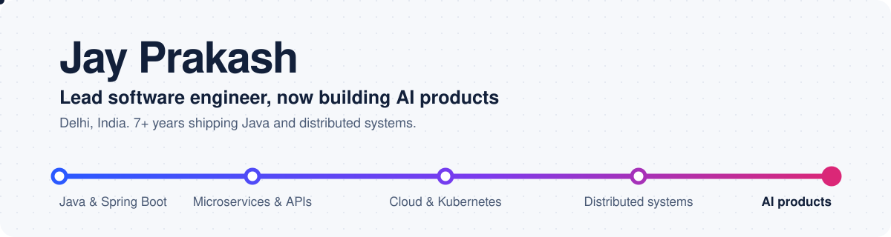
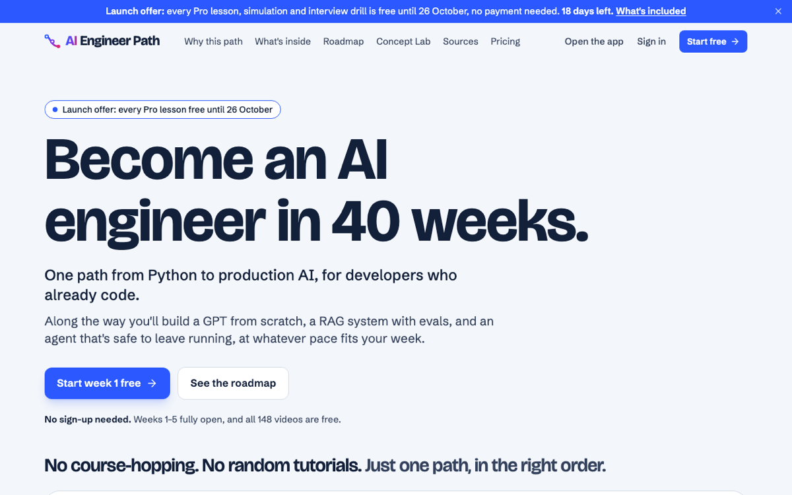
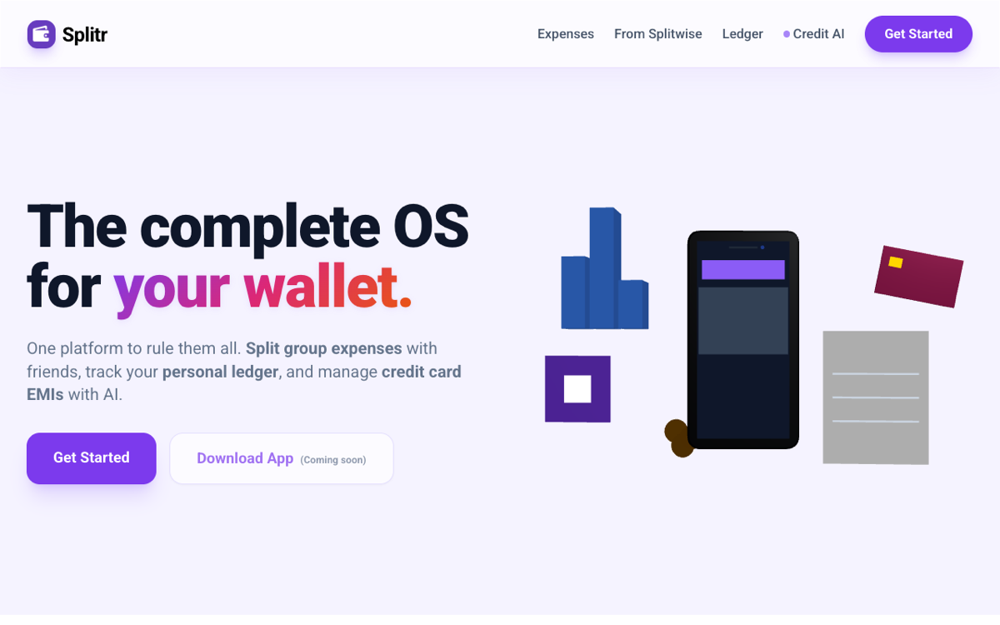

<picture>
  <source media="(prefers-color-scheme: dark)" srcset="assets/banner-dark.svg">
  
</picture>

I'm a lead software engineer with 7+ years of building backend systems in **Java and Spring Boot**: microservices, API platforms, cloud deployments and the distributed systems behind them. These days I take that production discipline into **AI products**, and I ship my own apps under **Jay Apps Studio**.

## What I've built

### [AI Engineer Path](https://aiengineerpath.in) · live

A learning platform that takes developers from Python to production AI in one structured path: machine learning, deep learning, building a GPT from scratch, then LLM apps, RAG, agents, evals and LLMOps.

- **247 original lessons** with worked examples, **22 interactive simulations** (attention, gradient descent, RAG, KV cache…), quizzes, exercises and interview questions for every topic
- A **pace engine** that re-dates 280 daily tasks to the hours each learner has, with progress synced across devices
- **Next.js 16 on Cloudflare Workers**, Supabase for auth and data, Razorpay payments, Resend email and Turnstile spam protection
- Built for speed and trust: staging that mirrors production, deploys that never break open pages, and full privacy, refund and grievance pages

### [Splitr](https://splitr.in) · live on the web, Android app in testing

The complete OS for your wallet: split group expenses with friends, keep a personal ledger, and manage credit card EMIs with AI. The [Android app](https://play.google.com/store/apps/details?id=in.splitr.app) (in closed testing) can also import your history from Splitwise.

- TypeScript app with a Postgres database, deployed on a VPS with Docker Compose and Caddy for automatic HTTPS

## Engineering projects

| Project | What it shows |
| --- | --- |
| [event-ledger](https://github.com/jay-prakash96/event-ledger) | Two FastAPI microservices that process financial events with **idempotency**, **out-of-order tolerance**, a hand-written **3-state circuit breaker** and **distributed tracing**, all in Docker Compose |
| [quick-pick](https://github.com/jay-prakash96/quick-pick) | An AI-assisted HR recruitment platform split into **microservices**: user management, job management, and resume parsing with candidate services |
| [algo-trader](https://github.com/jay-prakash96/algo-trader) | Full-stack trading workspace on **Zerodha Kite Connect**: FastAPI backend, Next.js frontend, live strategy charts, PnL and a strategy worker |
| [important-design-pattern](https://github.com/jay-prakash96/important-design-pattern) | **Gang of Four patterns in Spring Boot**, taken all the way to **AWS EKS** with Jenkins, Docker and Kubernetes CI/CD |

## Apps in progress

- **Guard**: a scam checker app built with **Flutter** and a **Firebase** backend
- **Freelio**: a self-hosted business platform for freelancers, covering invoices, expenses, contracts, clients, projects, tax and an **AI assistant** (Next.js, Prisma)
- **RecurraDoc**: AI document automation; upload a template, let AI find the variables, and generate finished documents in about a minute

These repositories are private. Happy to walk through any of them.

## How I work

- **Backend:** Java, Spring Boot, microservices, REST API platforms, Python and FastAPI, Node and TypeScript
- **Data:** PostgreSQL, Supabase, SQLite, Prisma, SQLAlchemy, Firebase
- **Cloud and delivery:** AWS EKS, Kubernetes, Docker, Jenkins, Cloudflare Workers, Caddy
- **Frontend and mobile:** Next.js, React, Tailwind CSS, Flutter
- **AI:** LLM features in production apps, RAG, evals and agents, and teaching all of it on AI Engineer Path

## Always learning

Repos I'm working through (forks): [hands-on AI engineer notebooks](https://github.com/jay-prakash96/ai-engineer-notebooks), the [system design primer](https://github.com/jay-prakash96/system-design-primer) and [interactive coding challenges](https://github.com/jay-prakash96/interactive-coding-challenges).

## Get in touch

[LinkedIn](https://www.linkedin.com/in/jay-prakash-331697116/), or try one of the apps above. I'm always glad to talk about backend systems, AI products, or what you're building.
